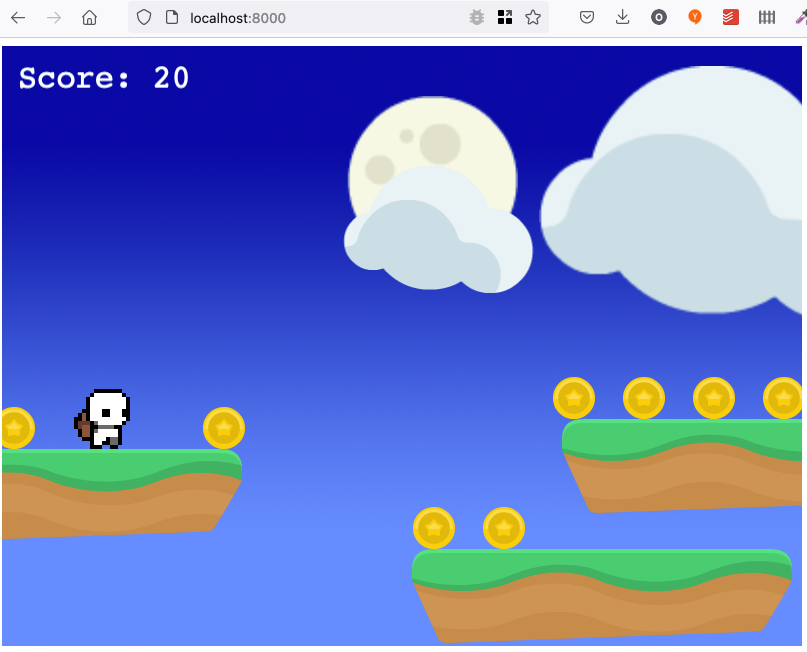

# Installation

Ich habe diese Installation mit `npm 8.9.0` auf meinem durchgeführt.

````
git clone git@github.com:byzanth/phaser.git
cd phaser
npm install
npm run build
npm start
````

Vielleicht ist die Version von ´npm` nicht neu genug. Dann hilft das hier:

````
sudo npm install -g n
sudo n 16.15
````

Danach musst du wahrscheinlich das Terminal schliessen und neu starten. 

Jetzt kann ich die HTML-Datei src/index.html aufg Port 8000 in Firefox öffnen:



Hier gibt es eine [kurze Einführung in die Programmiersprache _Typescript_](doc/typescript.md). 
