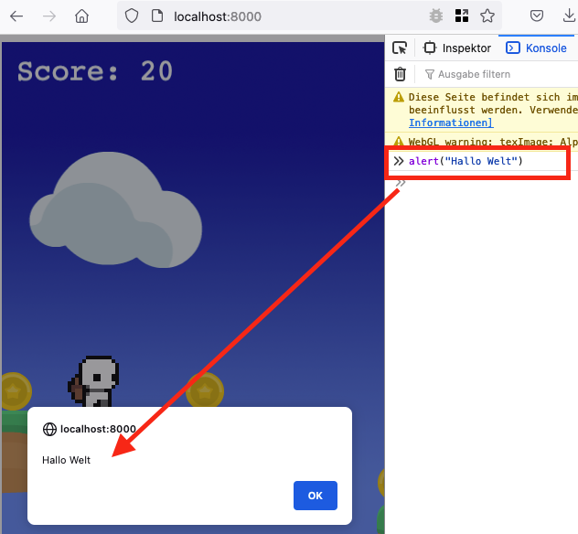

# Typescript

In Typescript kannst du Programme schreiben, die im Browser (Firefox, Chrome, ...) laufen. Der Browser spricht allerdings nicht direkt Typescript, sondern Javascript. Hier ist ein einfaches Javascript-Programm im Browser:



Um schnell einen Überblick über Typescript zu bekommen, habe ich mir [Learn X in Y](https://learnxinyminutes.com/docs/typescript/) angesehen. Hier ist eine Zusammenfassung:

Variable definiert man mit `let`:

````
// Kommentare schreibt man hinter "//"
let isDone = false;
let lines = 42;
let name = "Anders";
````

Anders als in Python beendet man Zeilen in Typescript mit einem Semikolon ";".

Es gibt in Typescript neben Zahlen, Wahr/Falsch ("Booleans" nach dem Mathematiker _George Boole_) und Zeichenketten ("Strings") auch Listen und Aufzählungen:

````
// Hier ist der _Typ_ der Listenelemente als "Zahl" festgelegt:
let list: number[] = [1, 2, 3];

// Aufzählungen
enum Color { Red, Green, Blue };
let c: Color = Color.Green;
````

Funktionen sind kleine Blöcke mit Code, die irgendwas machen. Man kann Funktionen in Typescript auf unterschiedliche Arten aufschreiben:

````
function meldung(name: string) {
  alert("Hallo " + name);
}

let m1 = function (name: string) { alert("Hallo " + name); }
let m2 = (name: string) => { alert("Hallo " + name); }
let m3 = (i: number) => i * i;
````

Dann gibt es noch Klassen und Objekte. Klassen beschreiben die Eigenschaften von Objekten:

````
class Point {
  // Eigenschaften
  x: number;

  // Constructor - "y" ist hier eine zweite Eigenschaft durch das "public" aber abgekürzt hingeschrieben:  
  constructor(x: number, public y: number = 0) {
    this.x = x;
  }

  // Funktionen. Die hier bestimmt den Abstand zum Ursprung des Diagramms
  dist(): number { return Math.sqrt(this.x * this.x + this.y * this.y); }

  // Das hier ist der Ursprung des Diagramms
  static origin = new Point(0, 0);
}
````

Das soll zum Start erst einmal reichen. Typescript hat noch viele weitere, manchmal merkwürdige Befehle. Die lernen wier kennen, wenn wir darüber stolpern.
